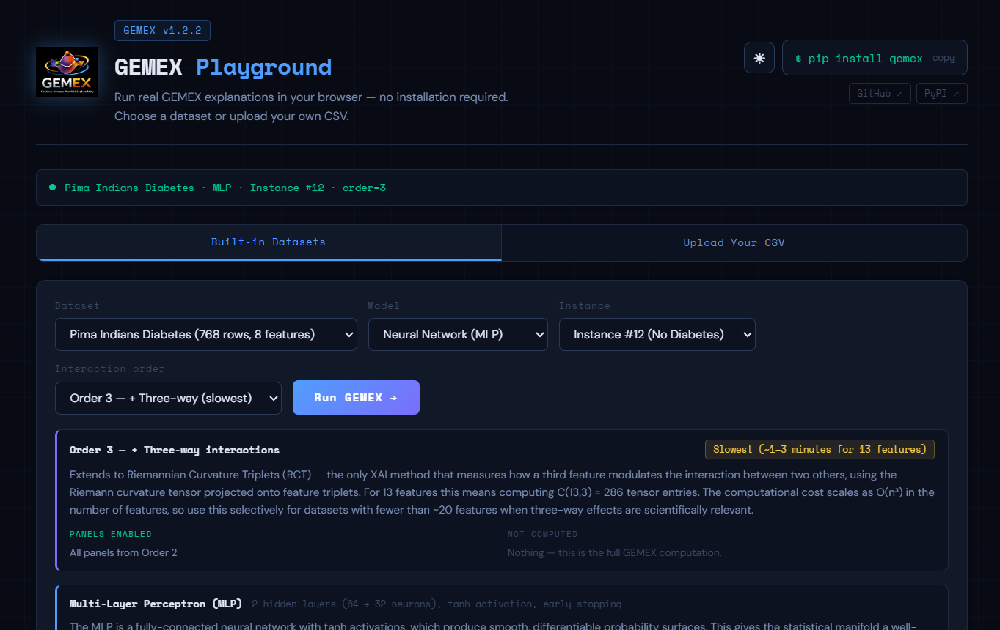
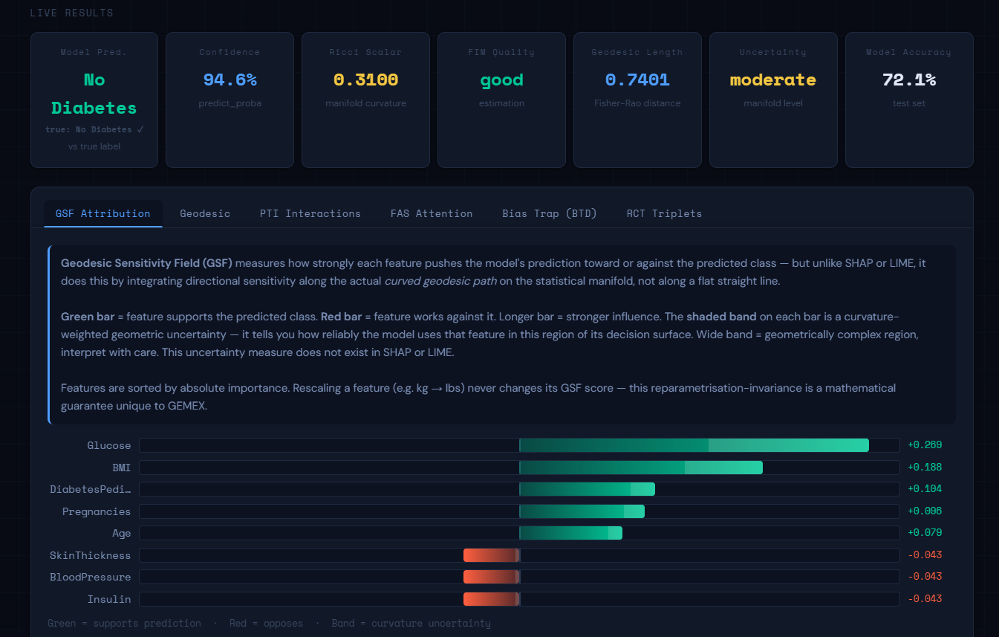
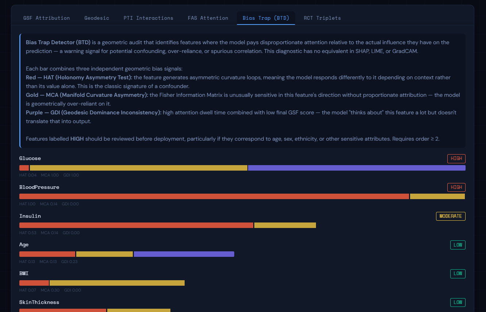
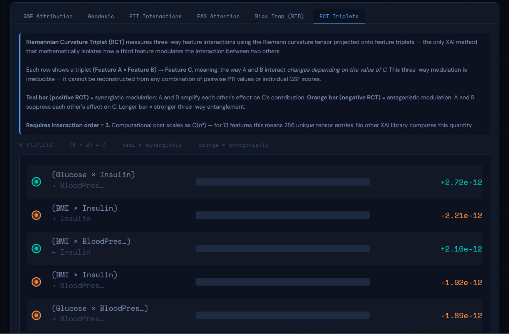

<div align="center">


# GEMEX Playground

### Run real GEMEX explanations in your browser — no installation required

[](https://github.com/utkukose/gemex)
[](https://pypi.org/project/gemex)
[](LICENSE)

**[→ Open the Playground](https://utkukose.github.io/gemex_playground/)**

</div>

---

GEMEX Playground is a single-file interactive browser application that runs the full [GEMEX](https://github.com/utkukose/gemex) XAI library locally in your browser via [Pyodide](https://pyodide.org) (Python compiled to WebAssembly). No server, no account, no Python installation needed. Open the page, wait ~20 seconds for the environment to load, then run real GEMEX explanations on medical datasets or your own CSV file.

This playground is a **hands-on introduction** to GEMEX. For the complete library with all 13 visualisation types, 14 example scripts, and validated comparative results, visit the main repository.

---

## Screenshots

### Controls and interaction order selector — dark mode



The header shows the GEMEX logo, version badge, a one-click `pip install gemex` copy button, and links to GitHub and PyPI. The instance selector displays human-readable class labels — for example **Instance #12 (No Diabetes)** — so the ground truth is immediately visible before running, with no ambiguity from raw 0/1 target values. The interaction order selector shows a live explanation panel that updates when you change the order, describing what is computed, which panels will appear, and the expected runtime. A green status dot and breadcrumb line (dataset · model · instance · order) confirm the last completed run at a glance.

---

### GSF Attribution and live metrics — dark mode



Seven metric chips above the panel display **Model Prediction**, **Confidence**, **Ricci Scalar**, **FIM Quality**, **Geodesic Length**, **Uncertainty**, and **Model Accuracy** simultaneously. The prediction chip shows both the model's predicted class and the ground truth label with a ✓/✗ correctness indicator, making misclassifications immediately visible without switching views.

The **Geodesic Sensitivity Field (GSF)** panel shows reparametrisation-invariant feature attribution computed by integrating directional sensitivity along the curved geodesic path on the statistical manifold. Green bars support the predicted class; red bars oppose it. The shaded band on each bar is a curvature-weighted geometric uncertainty — a confidence measure that does not exist in SHAP or LIME. Features are sorted by absolute importance; rescaling any feature never changes its GSF score, a mathematical invariance guarantee unique to GEMEX.

---

### Bias Trap Detection panel — dark mode



The **Bias Trap Detector (BTD)** is a geometric audit that identifies features where the model pays disproportionate attention relative to their actual influence on the prediction — a warning signal for confounding, over-reliance, or spurious correlation. This diagnostic has no equivalent in SHAP, LIME, or GradCAM. Requires interaction order ≥ 2.

Each feature row shows three independent geometric bias signals as stacked colour bars, with numerical subscores printed below: **red (HAT)** — holonomy asymmetry, the classic signature of a confounder; **gold (MCA)** — manifold curvature asymmetry, indicating geometric over-reliance; **purple (GDI)** — geodesic dominance inconsistency, flagging features the model attends to heavily but does not translate into output. Each feature receives a **HIGH / MODERATE / LOW** risk badge. Features labelled HIGH should be reviewed before deployment, particularly sensitive attributes such as age, sex, or ethnicity.

---

### RCT Triplets panel — dark mode



The **Riemannian Curvature Triplet (RCT)** panel shows three-way feature interactions computed from the Riemann curvature tensor — the only XAI method that mathematically isolates how a third feature modulates the interaction between two others. Each row displays a triplet **(Feature A × Feature B) → Feature C**: the way A and B interact changes depending on the value of C. This three-way modulation is irreducible and cannot be reconstructed from any combination of pairwise PTI values or individual GSF scores. No other XAI library computes this quantity.

Each triplet is rendered as a bubble (size proportional to strength) and a bar track. Values are displayed in scientific notation when magnitudes are small. **Teal** (positive) = synergistic modulation — A and B amplify each other's effect on C. **Orange** (negative) = antagonistic modulation — A and B suppress each other's effect on C. Requires interaction order = 3; computational cost scales as O(n³), meaning 286 unique tensor entries for 13 features.

---

## What runs in the playground

GEMEX Playground executes the complete GEMEX computation in your browser, including model training, geodesic path integration, Fisher Information Matrix estimation, and all interaction analyses. Six interactive panels are provided:

| Panel | What it shows | Requires |
|---|---|---|
| **GSF Attribution** | Reparametrisation-invariant feature importance with geometric uncertainty bands | Order 1+ |
| **Geodesic Arc-Length** | Cumulative manifold distance and local curvature profile along the geodesic path | Order 1+ |
| **PTI Interactions** | Holonomy-based pairwise feature interactions beyond what additive methods detect | Order 2+ |
| **FAS Attention** | Temporal attention sequence — which features the geodesic attends to and in what order | Order 2+ |
| **Bias Trap (BTD)** | Geometric audit for confounders, over-reliance, and spurious correlations (HAT + MCA + GDI) | Order 2+ |
| **RCT Triplets** | Three-way Riemannian curvature interactions — irreducible feature modulation | Order 3 |

---

## Interaction orders explained

The **interaction order** controls the depth of the GEMEX computation and which panels are enabled.

**Order 1 — Attribution only** *(fastest, ~5–10 seconds)*
Computes the core geodesic path, Fisher Information Matrix, and GSF scores for every feature. Produces the GSF Attribution and Geodesic Arc-Length panels. Already richer than SHAP or LIME — reparametrisation-invariant attribution with geometric uncertainty bands and a Ricci scalar. PTI, FAS, BTD, and RCT panels are not computed at this order and will indicate this clearly.

**Order 2 — + Interactions** *(recommended, ~15–30 seconds)*
Adds Parallel Transport Interaction (PTI) analysis, the Feature Attention Sequence (FAS), and the Bias Trap Detector (BTD). Unlocks five panels. Suitable for most practical XAI tasks.

**Order 3 — + Three-way interactions** *(slowest, ~1–3 minutes)*
Extends to Riemannian Curvature Triplets (RCT) — the only XAI method that quantifies how a third feature modulates the interaction between two others using the Riemann curvature tensor. For 13 features this means computing C(13,3) = 286 tensor entries, with O(n³) cost. Use selectively when three-way effects are scientifically relevant. All six panels are active.

---

## Built-in datasets

| Dataset | Rows | Features | Task |
|---|---|---|---|
| Cleveland Heart Disease (UCI) | 297 | 13 clinical | Binary: No Disease / Disease |
| Pima Indians Diabetes (UCI) | 768 | 8 physiological | Binary: No Diabetes / Diabetes |

---

## Upload your own CSV

Switch to the **Upload Your CSV** tab to explain any binary classification dataset. Requirements:

- CSV format with a header row
- Last column must be the binary target (0 or 1)
- No missing values
- Any number of features

Example format:

```
age,glucose,bmi,target
45,148,33.6,1
29,85,26.6,0
52,168,38.1,1
```

---

## Models available

**Gradient Boosting Machine (GBM)** — 100 trees, max depth 3, learning rate 0.1. Produces piecewise-constant probability surfaces with sharp decision boundaries, leading to higher and more variable Ricci scalar values. Robust to outliers and feature scaling.

**Neural Network (MLP)** — two hidden layers (64 → 32 neurons), tanh activation, early stopping. Produces smooth differentiable probability surfaces, giving the statistical manifold a well-behaved geometry with lower and more consistent Ricci scalars. GEMEX achieves higher monotonicity scores on MLP than GBM because the geodesic integrator performs better on smooth surfaces. Feature scaling is applied automatically via StandardScaler before training.

---

## How it works

The playground embeds the full GEMEX source code and both datasets into a single HTML file. When opened in a browser, it downloads the [Pyodide](https://pyodide.org) WebAssembly runtime, installs numpy, scipy, scikit-learn, and pandas, writes the GEMEX source into the browser's virtual filesystem, and imports the library. After the initial load, all computation runs entirely locally — no data leaves your browser.

```
Open HTML → Pyodide loads (~20s) → GEMEX installs → Select data → Run → Live results
```

---

## Using the full GEMEX library

The playground provides six panels as a hands-on introduction. The full GEMEX library offers 13 visualisation types, batch explanations, image XAI (GeodesicCAM, ManifoldSeg, PerturbFlow), time series support, and validated comparative results against SHAP, LIME, and ELI5 across multiple model families.

**Install:**

```bash
pip install gemex
```

**Quick start:**

```python
from gemex import Explainer, GemexConfig

cfg = GemexConfig(n_geodesic_steps=20, n_reference_samples=60, interaction_order=2)
exp = Explainer(model, data_type='tabular', feature_names=feat,
                class_names=['No', 'Yes'], config=cfg)

result = exp.explain(x_instance, X_reference=X_train)
print(result.summary())
result.plot("gsf_bar", theme="dark")
result.plot("network", theme="dark")
result.plot("triplet_hypergraph", theme="dark")  # interaction_order=3
```

→ **[Main GEMEX repository — README, examples, validated results](https://github.com/utkukose/gemex)**

→ **[PyPI page — installation, version history, dependencies](https://pypi.org/project/gemex)**

---

## Repository contents

```
gemex_playground.html   Single-file playground application (self-contained)
docs/
  screenshots/          Screenshots used in this README
LICENSE                 MIT License
```

---

## License and authorship

MIT License · Copyright © 2026 Prof. Dr. Utku Kose

Suleyman Demirel University, Turkey · University of North Dakota, USA · VelTech University, India · Universidad Panamericana, Mexico

GEMEX was developed through a human-AI collaboration. The theoretical framework, mathematical foundations, and research directions are the original intellectual contribution of Prof. Dr. Utku Kose.

[utkukose@gmail.com](mailto:utkukose@gmail.com) · [www.utkukose.com](https://utkukose.com) · [ORCID 0000-0002-9652-6415](https://orcid.org/0000-0002-9652-6415)
